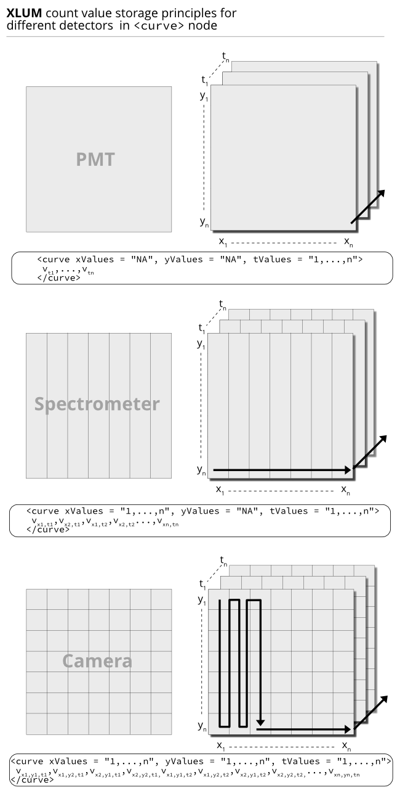

# Motivation and principles

This documents details the `XLUM` format, an XML based file format for long-term
data preservation and exchange of luminescence data. The format is readable by 
humans and machines and the data can be easily checked with any kind of text reader, 
on any major operating system. This allows a platform independent operation. 
The following documentation provides basic information on the file `XLUM` format 
and accounts for the needs for individual flexible data analysis, even with 
self-written software applications.

The format is underpinned by a two very simple guiding principles

* Stored are data recorded over **time**
* Stored are data on a technical component level 

# General description

The XLUM-format is an XML derivative, i.e. the base data structure is a tree with five nodes 
storing the data. Each level has its unique denotation.

The levels and a short introduction is given in table below, a detailed description 
can be found in the following sections. Each level in the structure is represented by a node. 
**Only the node `curve` contains luminescence data** all other nodes are parent nodes of `curve` 
to structure the dataset and ship additional metadata. 

The first level `xlum` is a super node to enable storage of luminescence data 
in arbitrary files following the XML scheme. As a side effect this 
also allows custom file endings different from `*.xlum`.


  |Node name   | Number of samples   |Number of aliquots  | Number of records  | Number of data curves |
  |------------| --------------------| -------------------| -------------------| ----------------------|
  xlum         |$\inf$               |$\inf$              |$\inf$              |$\inf$  
  sample       |1                    |$\inf$              |$\inf$              |$\inf$
  sequence     |1                    |1                   |$\inf$              |$\inf$
  record       |1                    |1                   |1                   |$\inf$
  curve        |1                    |1                   |1                   | 1  

  Table: Node overview

A node has a name, attributes, and data stored in it. The data stored in the attributes
describes the state of this level. The stored data in the node describes
the process(es) assigned to the node. An minimal example is shown in the
listing. The documentation provides an overview starting with the leaf node
description and going up to the root from there. Further notes:

* The format version bases on XLM version 1.0
* File encoding should be always UTF-8
* This specification lists only mandatory attributes. Additional, custom attributes,
are explicitly supported.
* Parser supporting the `XLUM` format must not crash when encountering non-specified
node attributes, however, they are allowed to skip them.

```{r basic example xlum, engine='bash', eval = FALSE}
<?xml version="1.0" encoding="utf-8"?>
<xlum formatVersion="1.0" flavour="generic" author="" license="" doi="">
  <sample>
    <sequence>
      <record>
        <curve> 
          1,2,...,n
        </curve>
      </record>
    </sequence>
  </sample>
</xlum>
```

# Detailed description

## The `<curve>` level

The `curve` level is the deepest node (leaf) and has no further sub-levels. 
A curve holds the predefined/simulated or measured output of one single 
technical component. For example, a typical thermoluminescence measurement 
may record only one or three or more curves.

 1. **The one curve example**: Time against temperature (which is probably a processed 
 quantity). 
 2. **The three curve example**: (a) Time against temperature recorded by thermocouple 
 (temperature sensor), (b) time against photon counts recorded by a photomultiplier tube, 
 (c) time against a predefined heating ramp.

In both cases, all mentioned `curve` nodes belong to one parent `record`. In case 1, 
the record contains one curve and three in case 2. Ideally, curves represent technical 
components and not processed quantities. 

### Attributes

  |Identifier                     |Type        |Allows `NA`? |Example                         |Information   |
  |-------------------------------|----------- |-------------|--------------------------------|--------------|
  startDate                       | `date`     |No           |`"2021-07-14T22:59:35.0Z"`      | ISO 8601-1:2019: `YYYY-MM-DDThh:mm:ss[.mmm]Z` recalculated to Zulu time |
  curveType                       | `string`   |No           |`"predefined"`                  | Values allowed are only `"predefined"` or `"measured"`    |
  duration                        | `number`   |No           |`"20.000"`                      | Duration of the measurement in seconds or a fraction of it|
  offset                          | `number`   |No           |`"10.000"`                      | Before the detection starts in seconds or a fraction of it|
  xValues                         | `number`   |Yes          |`"1.0,2.0,3.0"`                 | x-coordinate values of the detector                       |
  yValues                         | `number`   |Yes          |`"1.0,2.0,3.0"`                 | y-coordinate values of detector                           |
  tValues                         | `number`   |No           |`"1.0,2.0,3.0"`                 | time values in seconds or a fraction of it                |
  xLabel                          | `string`   |Yes          |`"pixel"`                       | label of the x-coordinate values                          |
  yLabel                          | `string`   |Yes          |`"pixel"`                       | label of the y-coordinate values                          |  
  tLabel                          | `string`   |No           |`"time"`                        | label of t-values, usually 'time'                         |
  xUnit                           | `string`   |Yes          |`"nm"`                          | SI unit or equivalent for x-values                        |
  yUnit                           | `string`   |Yes          |`"px"`                          | SI unit or equivalent for y-values                        |
  tUnit                           | `string`   |No           |`"s"`                           | SI unit or equivalent for t-values                        |
  stimulator                      | `String`   |Yes          |`"SiN heater"`                  | name of the technical component. `NA` allowed only for `"predefined"` |
  [detector]                      | `String`   |No           |`"EMI 9235QB15"`                | technical name of the component can be `NA` for `"predefined"`|
  [detectionWindow]               | `String`   |No           |`"375"`                         | Centre wavelength if applicable. can be set to `NA`    |
  [filter]                        | `List` (`String`) |No    |`"Hoya U340; Delta BP 365/50EX"`|  Filter names separated by `;` |

Table: Specified curve attributes. Attributes in `[]` are optional, hence `NA` is not allowed.

### Value storage

```{r, echo=FALSE, fig.align='center', fig.cap="The three cases for data storage depending on the detector.", fig.width=12}

```

### Example 

In order to define a suitable standard only a few attributes are required. A few of them are useful for every kind of component, 
others are only meaningfully in combination. For instance, providing information on the detection window is not meaningful for 
a heating element. Listing shows some definitions that are intended on this level.

```{r, engine='bash', eval = FALSE}
{...}
<record name="TL measurement">
  <curve startDate="2021-02-14T225935.0Z" duaration="120" offset="0"
     curveType="predefined" curveDescriptor="time (s), temperature (K)" 
     stimulator="heating element">
        0,273;60,393;120,493
  </curve>
  <curve startDate="2021-02-14T225935.0Z" duaration="120" offset="0"
     curveType="measured" curveDescriptor="time (s), luminescence (cts)"
     stimulator="heating element" detector="EMI 9235QB" detectionWindow="375"> 
        0,30;10,33;20,452;...;120,200;
    </curve>
    {...}
</record>
{...}
```

One curve is related to one technical device. To define a accurate time
window, the parameters *duration* and *offset* should be used. 
These parameters are related to the start of the parent record.

## The `<record>` level

The Record defines one process. That process is further described by the
stored curves. A record can also be understood as one step of
measurement. Curves are stored in a record and used to describe it.

### Attributes

  |identifier          | data type / structure  | example                  |information
  |--------------------| -----------------------| ------------------------ |----------------------------------------------------------|
  |startDate           |  `Date`                  |  20130214100122          |date when the computer software started the measurement   |
  |endDate             |  `Date`                  |  20130213100242          |  date when the computer software finished the measurement |
  |recordType          |  `Enumeration`           |  TL                      |  legal values found in next table                        |
  |name                |  `String`                |  2nd thermoluminescence  |  user given name of the record     |
  |sequenceStepNumber  |  `number`                |  5                       |  index in the sequence     |
  |metaIrrType         |  `String`                |  none                    |  describes the type of irradiation   |
  |metaIrrDuration     |  `number`                |  7200.0                  |  time $[s]$ the aliquot has been irradiated    |
  |sampleCondition     |  `Enumeration`           |  dose                    | legal values found in next table   |

Valid recordTypes:

  |recordType          | information      |
  |--------------------| -------------------------------|
  |bleaching           | bleaching                |
  |irradiation         |  irradiation           |
  |atmosphereExchange  |  atmosphere exchange   |
  |preheat             |  preheat       |
  |spectrometer        |  spectrometer    |
  |camera              |  camera      |
  |TL                  |  thermoluminescense      | 
  |RF                  |  radiofluorescense       |
  |OSL                 |  optical stimulated luminescense |
  |pause               |  pause     |
  |custom              |  custom      |
  |none                |  none      |
  |POSL                |  pulsed optical stimulated luminescense |

valid sampleConditions:

  |sampleConditions   |  information        |
  |-------------------| --------------------|
  |Natural             | Natural          |
  |Natural+Dose       |Natural+Dose     |
  |Bleach             |  Bleach  |
  |Bleach+Dose        |  Bleach+Dose  |
  |Nat.(Bleach)       |  Nat.(Bleach)  |
  |Nat.+Dose(Bleach)  |  Nat.+Dose(Bleach) |
  |Dose               |  Dose  |
  |Background         |  Background |


### Example 
All curves within the record should have been detected within the same
time frame. An example is given in listing

```{r, engine='bash', eval = FALSE}
{...}
<Sequence name="SAR OSL CW">
      {...}
      <Record startDate="20130214225935" endDate="20130214230124"
       recordType="OSL" name="green OSL CW" comment="standard OSL curve for Le and Ne"
      >
    <Curve {...}>
      {...}
        </Curve>
        <Curve {...}>
          {...}
        </Curve>
    {...}
      </Record>
      <Record startDate="20130214230132" endDate="20130222013020"
       recordType="bleach" name="bleaching"
      >
        <Curve {...}>
          {...}
        </Curve>
      </Record>
      {...}
</Sequence>
{...}
```

## The `<sequence>` level

A sequence describes multiple measurements sequential used at one
aliquot. The first step often is the unloading of a probe from the
storage, and the last to transfer the probe back.

### Attributes

  |identifier     |data type / structure  | example                  | information        |
  |-------------- |-----------------------| -------------------------| -----------------------------------|
  |position       |`number`                 | 42                      |  position in the sample wheel |
  |creationDate   |`Date`                   | 20130214100242          |  date when this sequence was created |
  |name           |`String`                 | SAR OSL CW - derivative  | user name for this sequence |
  |protocol       |`String`                 | SAR OSL CW              |  name of the protocol used |
  |mineral        |`String`                 | aluminium oxide         |  name of the substance used  |

In the luminescence context a sequence can fit a SAR protocol. It is
defined that all measurements hold by one sequence are made with one
aliquot.

### Example

```{r, engine='bash', eval = FALSE}
<Sequence state="finished" parentID="1010071454551909" name="TL spectra Feldspar" position="18" comment="" creationDate="20131007145455" protocol="" mineral="">
  {...}
</Sequence>
```

## The `<sample>` level

The sample builds the top level. In one file is always only one sample
stored. It defines the parameter of the used system.

### Attributes 

  |identifier         |data type / structure  | example                          | information            |
  |------------------ |-----------------------| ---------------------------------| ------------------------------------------|
  |name               |`number`                 | analyse of Hanburg/Germany/1989  |  user given name           |
  |user               |`String`                 | Jane Doe                         |  name of the person in authority     |
  |startDate          |`Date`                   | 20130217100242                  |  start of the analyse     |
  |sampleCarrier      |`String`                 | unknown                          | used sample carrier    |
  |lexsyg           |`number`                 | 201312                          |  ID to identify the used measurement system|
  |lexStudioVersion   |`decimal`                | 1.0                              | version of the used measurement software|
  |firmwareVersion    |`decimal`                | 0.6                             |  version of the firmware in the lexsyg system |
  |os                 |`String`                 | aluminium oxide                  | operating system of the computer |


### Example 

```{r, engine='bash', eval = FALSE}
<Sample state="finished" parentID="0" name="TL spectra Feldspar" user="" 
    startDate="20131007145455" sampleCarrier="" leXLUMID="11-re-01-0006" 
    lexStudioVersion="Lexstudio 2beta 0.15.0" 
    firmwareVersion="unknown" os="Microsoft Windows NT 6.1.7601 Service Pack 1" comment="">
    {...}
</Sequence>
```

## The `<xlum>` level 

### Attributes

### Example


## General parameters

There are a few parameters that are stored on every level.

  |identifier   |data type / structure  | example                             |information      |
  |------------ |-----------------------| ----------------------------------- |----------------------------------|
  |state        |`enumeration`            | analyse of Hanburg/Germany/1989     |Values: {finished, recording, …} |
  |parentID     |`number`                 | 201007145551910                     |ID of the parent node  |
  |comment      |`String`                 | measurement to verify a assumtion   |   |
  
## Pulsing data

In measurements with pulsed light stimulation, multiple detector curves might be stored per record, one for each (x) pulse(-s).
The record contains some additional Metadata

  |identifier        | data type    |example    |information            |
  |------------------| ------------ |---------- |---------------------------------------|
  |OnTime           |  `number`      | 1E-01     | on time of stimulation per pulse, [s]     |
  |OffTime          |  `number`      |  1E-01   |   on time of stimulation per pulse, [s]    |
  |NrPulses         |  `number`      |  10      |   number of stimulation pulses total     |
  |Summations       |  `number`     |  2        |  how many consecutive pulse records are summated (e.g. 10 pulses, 2 summations -> 5 records) |
  |ChannelsPerPulse |  `number`     |  1000      | number of channels that are recorded in one curve      |
  |CountsNormalized  | `number`      | 1        |  if not 0, counts per channel are normalized to counts per second (helpful with uneven distributed channel times) |
  
Also the curves contain additional metadata

  |identifier         |data type   | example    |information |
  |------------------ |------------| ---------- |---------------------------------------|
  |PulseNr            |`number`      |1          | current Pulse |
  
Pulsing Curves typically contain value pairs of channel time in microseconds and counts, see curveDescripter.

# Practical guidlines

An import function must not crash parsing the following minimal example.

```{r, engine='bash', eval = FALSE}
<?xml version="1.0" encoding="utf-8"?>
<Sample>
  <Sequence>
    <Record>
      <Curve>
      </Curve>
    </Record>
  </Sequence>
</Sample>
```
